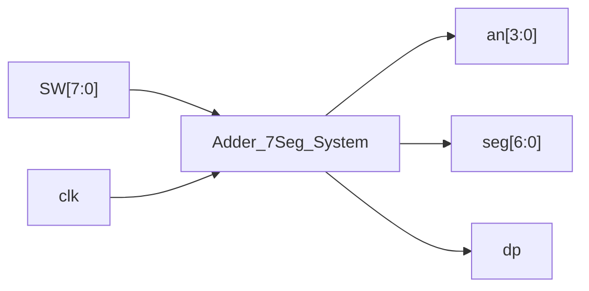

# Random-

## Level-0 Block Diagram


```mermaid 

flowchart LR
  A["SW[3:0] (A)"] --> ADDER
  B["SW[7:4] (B)"] --> ADDER
  CI0["CI=0"] --> ADDER

  subgraph ADD ["adder4_cla"]
    ADDER
  end

  ADDER --> SUM5["sum5[4:0] = {CO,SUM}"]
  SUM5 --> BCD["bin5_to_bcd"]

  CLK["clk"] --> MUX
  BCD --> MUX

  subgraph MUX ["seven_seg_mux (+ seven_seg_decoder)"]
    MUX
  end

  MUX --> AN["an[3:0]"]
  MUX --> SEG["seg[6:0]"]
  MUX --> DP["dp"]


```

